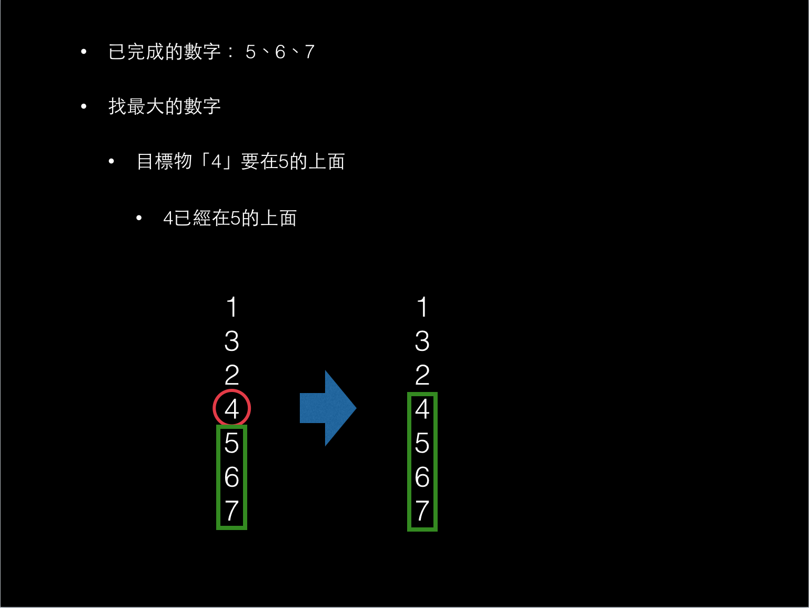

# 解析Pancake sorting ruby code

臨摹這段code，真的太精彩了
- [Sorting algorithms/Pancake sort - Rosetta Code](https://rosettacode.org/wiki/Sorting_algorithms/Pancake_sort#Ruby)

開始閱讀前，建議先看過這份我寫的投影片：[pancake sorting 解析](http://www.slideshare.net/ssuser5a7ddc/pancake-sorting-ruby)

現在開始step by step講解

---

我的目標是要寫一個method，來翻array裡的數字

由於這個method是要用來處理陣列，所以我要先寫

```
class Array
  def pancake_sort!

  end
end
```

因為我希望經過`pancake_sort`翻轉的array存到原始的array裡去，所以在結尾加上`!`，使得我的method名稱變為`pancake_sort!`

在投影片中有說到關鍵步驟
- 撈出最大的
- 最大的那個數字以上整疊都翻轉，讓最大的數字翻到最上面
- 接著讓全部的數字整疊翻轉，如此一來翻到最底下的就是剛剛在上面的最大數字
- 翻到底的最大數字捨棄不計，撈下一個最大數字

這個範例精妙的地方在於用了`downto`與`next if`

# 撈出最大的 and 翻到底的最大數字捨棄不計

一開始

```
class Array
  def pancake_sort!
    (self.size-1).downto(1) do |end_idx|
      max = self[0..end_idx].max
    end
  end
end
```

`downto`是一個神奇的method，讓我們可以簡單便利地寫「數字的遞減」
- [Ruby Iterators: Times, Step Loops](https://www.dotnetperls.com/iterator-ruby)，搜尋「downto」

用`size-1`是考慮到迭代的變數`end_idx`

因為array的index是從0開始，假如我們的array是`[6,9,4,5,7]`這樣這個array的`size`就是5，但是array的index是`[0,1,2,3,4]`，為了要讓迭代的變數從index`0 ~ n-1`中撈出最大，所以在一開始要用`self.size-1`


接著用`index`撈出最大數字(max)的index
- [index - Class: Array (Ruby 2.4.0)](http://ruby-doc.org/core-2.4.0/Array.html#method-i-index)

```
class Array
  def pancake_sort!
    num_flips = 0
    (self.size-1).downto(1) do |end_idx|
      max = self[0..end_idx].max
      max_idx = self[0..end_idx].index(max)
    end
  end
end
```

---

接著這段是我覺得ruby神奇的地方:`next if`
- [Ruby 程式語言學習筆記（三）：Ruby的循環迴圈(Loops) - Just Node.js](https://nodejust.com/ruby-program-tutorials-loops-iterators/)，搜尋「next if」

```
class Array
  def pancake_sort!
    num_flips = 0
    (self.size-1).downto(1) do |end_idx|
      max = self[0..end_idx].max
      max_idx = self[0..end_idx].index(max)

      next if max_idx == end_idx
    end
  end
end
```

這段code真的太精彩了。

在手寫推導演算法時，會發現
- 撈出最大的，兩次翻轉放到最下面
- 已經被撈過的最大的就不再考慮

透過`downto`所產生的遞減數字，可以讓我們的array迭代的數字越來越少

以`[6,9,4,5,7]`為例。這串array若是透過`(self.size-1).downto`迭代，最初`end_idx`是4，此時可影響的範圍是index:0~4，依照演算法`pancake_sort!`跑完一輪後最大的數字放到最下面，再來`end_idx`是3，此時可影響的範圍是index:0~3，先前被搬到最下面的數字，就不會被影響到

所以我說`downto`真的讓人太驚豔了


再來要說`next if`

在投影片中有看到一種情境：最大的數字已經在適當的位置了，不用翻轉



上面這圖就是`next if max_idx == end_idx`的情境，如果最大數字的index(`max_idx`)與`end_idx`一致，那麼就跳過(`next`)。

---

接著下面的code都很直覺。

# 最大的那個數字以上整疊都翻轉

最大的那個數字以上整疊都翻轉，讓最大的數字翻到最上面

```
class Array
  def pancake_sort!
    num_flips = 0
    (self.size-1).downto(1) do |end_idx|
      max = self[0..end_idx].max
      max_idx = self[0..end_idx].index(max)

      next if max_idx == end_idx

      if max_idx > 0
        self[0..max_idx] = self[0..max_idx].reverse  # 最大的那個數字以上整疊都翻轉，讓最大的數字翻到最上面
        p [num_flips +=1, self]
      end
    end
  end
end
```

# 接著讓全部的數字整疊翻轉

接著讓全部的數字整疊翻轉，如此一來翻到最底下的就是剛剛在上面的最大數字

```
class Array
  def pancake_sort!
    num_flips = 0
    (self.size-1).downto(1) do |end_idx|
      max = self[0..end_idx].max
      max_idx = self[0..end_idx].index(max)

      next if max_idx == end_idx

      if max_idx > 0
        self[0..max_idx] = self[0..max_idx].reverse  # 最大的那個數字以上整疊都翻轉，讓最大的數字翻到最上面
        p [num_flips +=1, self]
      end

      self[0..end_idx] = self[0..end_idx].reverse    # 整疊翻轉，讓最上面最大的數字，翻到最底下
      p [num_flips +=1, self]
    end

    return self
  end
end
```

由於前面有`downto`生成的`end_idx`，所以被放到最底下的最大數字，經過一次迭代後，就不會再被撈到

# 生成亂數排列的array

`a = (1..9).to_a.shuffle`
- [shuffle - Class: Array (Ruby 2.2.0)](https://ruby-doc.org/core-2.2.0/Array.html#method-i-shuffle)
